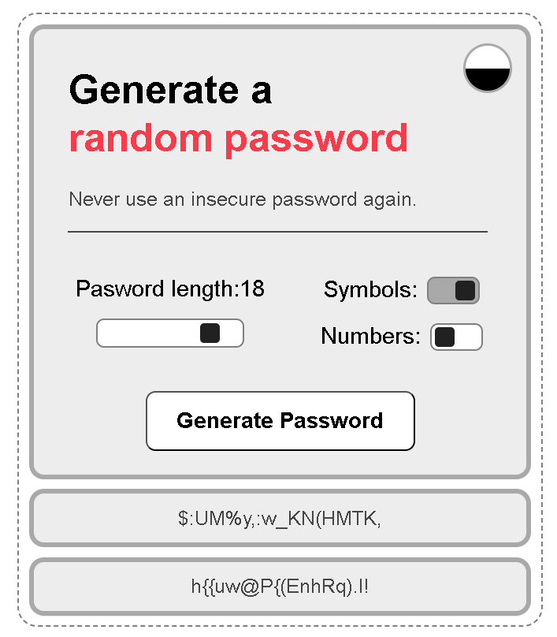
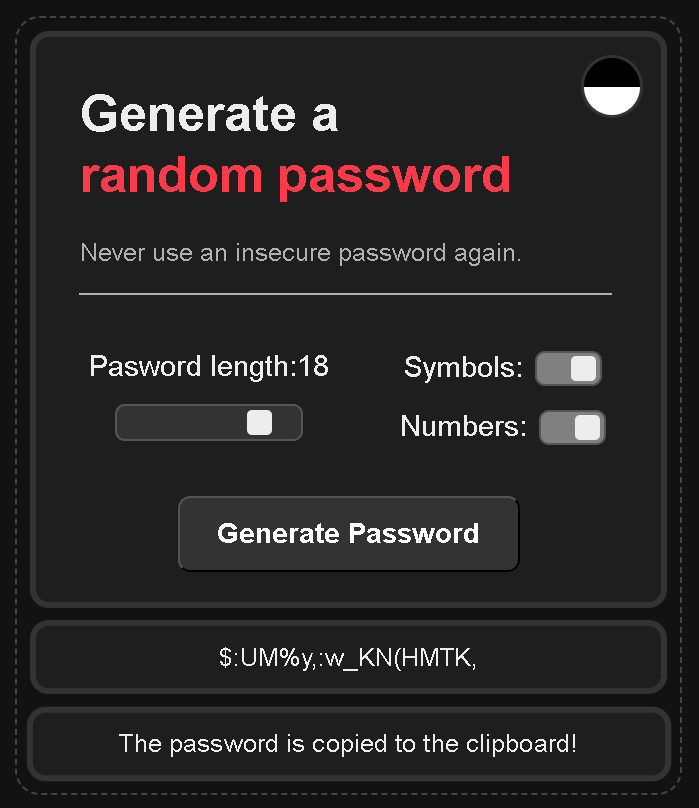

# 🔐 Password Generator Web App

A modern and interactive **Password Generator** built using **HTML, CSS, and JavaScript**, designed with both usability and aesthetics in mind.

This app allows users to generate secure passwords with full control over length, symbols, and numbers—wrapped in a clean UI with dark mode support.

---

## 🚀 Live Demo

👉 Not available yet

---

## 📸 Preview

### ☀️ Light Mode



### 🌙 Dark Mode



---

## ✨ Features

* 🔑 Generate two random secure passwords instantly
* 🎚 Adjustable password length using slider
* 🔢 Toggle to include numbers
* 🔣 Toggle to include symbols
* 🌗 Smooth dark/light mode toggle
* 📋 Copy password to clipboard with feedback
* ⚡ Clean, minimal, and responsive UI

---

## 🧠 What I Learned

This project helped me strengthen:

* DOM manipulation and dynamic UI updates
* Event-driven programming
* Conditional logic using toggle states
* Randomized algorithm design
* Clipboard API integration
* UI/UX thinking with dark mode implementation

---

## 🛠️ Tech Stack

* **HTML5** – Structure
* **CSS3** – Styling, Flexbox, transitions
* **JavaScript (Vanilla)** – Logic & interactivity

---

## ⚙️ How It Works

1. Choose password length using the slider
2. Enable/disable:

   * Symbols
   * Numbers
3. Click **Generate Password**
4. Click on a password to copy it instantly

---

## 💡 Future Improvements

* Password strength indicator
* Better copy feedback animation
* Option to exclude similar characters (e.g., O, 0, l)
* Mobile-first optimization
* Save password history

---

## 📂 Project Structure

```bash
Password-Generator/
│── index.html
│── style.css
│── script.js
│── assets/
│   ├── light-mode.png
│   └── dark-mode.png
```

---

## 📚 Learning Journey

Built as part of my Full Stack learning journey via:

👉 https://scrimba.com/?via=u43a7734

---

## 🙌 Connect With Me

* 🔗 LinkedIn: https://www.linkedin.com/in/fakhar-e-alam-a046133b4/
* 💻 GitHub: https://github.com/ThisisAlam

---

## ⭐ Support

If you found this project useful or interesting, consider giving it a ⭐ on GitHub!

---
